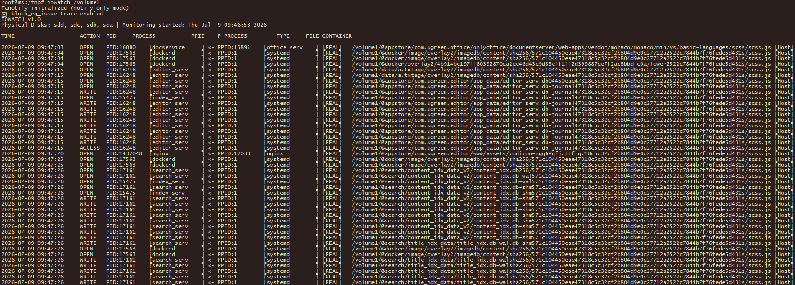
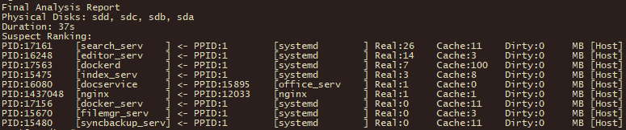

# IOWatch - Physical Disk Sleep & Hibernation Analyzer

<p align="center">
  <a href="#english">English</a> | <a href="#chinese">简体中文</a>
</p>

---

<h2 id="english">🌟 Overview</h2>

**IOWatch** is a high-performance, lightweight disk I/O monitoring tool specifically designed to identify the "culprits" preventing hard drives from hibernating on Linux systems (e.g., NAS, OpenWrt routers, and servers). 

By leveraging the kernel's `fanotify` and `block trace` mechanisms, IOWatch doesn't just show you *that* I/O is happening—it shows you exactly **which file**, **which process**, and **which container** is responsible.

### 📸 Screenshots

#### Real-time Monitoring
Track every file access with precision, distinguishing between cached operations and real physical disk hits.


#### Final Analysis Report
A summarized ranking of "suspect" processes at the end of the session to help you quickly identify the most frequent offenders.


---

## ✨ Key Features
*   **Precise Localization**: Tracks specific file paths and the executable path of the triggering process.
*   **Block Layer Correlation**: Correlates file-system events with actual physical disk displacement (`block_rq_issue`) to confirm if an I/O actually "woke up" the disk.
*   **Container Penetration**: Automatically detects if a process is running inside Docker or Containerd and displays the container info.
*   **Real vs. Cache Detection**: Distinguishes between operations served by RAM cache and those requiring physical disk access.
*   **Zero Dependencies**: Static compilation (no GLIBC required), works on almost any Linux distribution.
*   **Low Overhead**: Event-driven (no polling), ideal for low-power embedded devices.

---

## 📥 Quick Start
1.  **Download**: Get the binary for your architecture from the **Releases** page.
2.  **Upload**: Transfer the file to your device (via SCP, SMB, or File Manager).
3.  **Run**:
    ```bash
    chmod +x iowatch-arm64
    # Identify your mount point (e.g., /volume1 or /mnt/sda1)
    sudo ./iowatch-arm64 /volume1
    ```

---

## ⚙️ Options
| Option | Description |
| :--- | :--- |
| `-L <cn/en>` | Language (default: en) |
| `-o <file>` | Save log to CSV (Must NOT be on the monitored disk!) |
| `-D, --daemon`| Run in background (requires -o) |
| `-s <time>` | Scheduled start (e.g., +10m, +2h, or 202601011200) |
| `-e <dur>` | Run duration (e.g., 30m, 1h, 1d) |
| `-q` | Quiet mode (disable screen output) |

---

<h2 id="chinese">🌟 简介</h2>

**IOWatch** 是一款专为 Linux 系统（如 NAS、OpenWrt 路由器、服务器）开发的磁盘 I/O 深度分析工具。它通过监控内核事件，帮助用户精准锁定那些导致**硬盘无法休眠**或**频繁被唤醒**的进程。

### 📸 软件截图

#### 实时监控界面
实时显示文件访问日志，区分 `[真实]` 物理 IO 与 `[缓存]` IO。


#### 最终分析报告
运行结束自动生成嫌疑进程排名，帮助您快速找到频繁唤醒硬盘的“元凶”。


---

## ✨ 核心特性
*   **精准溯源**：利用 `fanotify` 机制，追溯触发操作的完整进程路径及父进程。
*   **块层关联**：结合 `block_rq_issue` 追踪，准确判断 IO 是否穿透缓存到达了物理磁头。
*   **容器穿透**：原生支持 Docker / Containerd，自动识别并标注触发 IO 的容器信息。
*   **休眠分析**：自动计算空闲时长，并记录每次“唤醒”磁盘的具体进程。
*   **极低开销**：基于事件驱动，无需高频轮询，适合嵌入式设备长期挂机。
*   **零依赖**：采用静态编译，不依赖 GLIBC，在任何 Linux 发行版上都能拷贝即用。

---

## 📥 快速开始
1.  **下载**：从 **Releases** 页面下载对应架构的二进制文件。
2.  **上传**：通过 SCP、网盘或文件管理器将文件上传到设备。
3.  **运行**：
    ```bash
    chmod +x iowatch-arm64
    # 查看挂载点 (例如 /volume1)
    sudo ./iowatch-arm64 /volume1
    ```

---

## ⚙️ 常用选项
| 选项 | 说明 |
| :--- | :--- |
| `-L cn` | 切换至中文界面 |
| `-o <文件>` | 将日志保存为 CSV (**严禁放在被监控的磁盘上！**) |
| `-D` | 后台运行模式 (需要配合 -o 使用) |
| `-s <时间>` | 定时启动 (如 +10m, +2h, 或 202601011200) |
| `-e <时长>` | 运行时长 (如 30m, 1h, 2d) |
| `-t` | 仅测试磁盘识别逻辑 |

---

## ⚠️ 注意事项
*   **内核要求**：建议 Linux 5.1 及以上版本。
*   **权限**：必须以 `root` 或 `sudo` 权限运行。
*   **日志位置**：若使用 `-o` 输出日志，请务必将日志保存在 SSD 或内存盘（如 `/tmp`）中，**禁止保存在被监控的机械硬盘上**，否则会导致循环触发无法休眠。

---
**IOWatch v1.0**